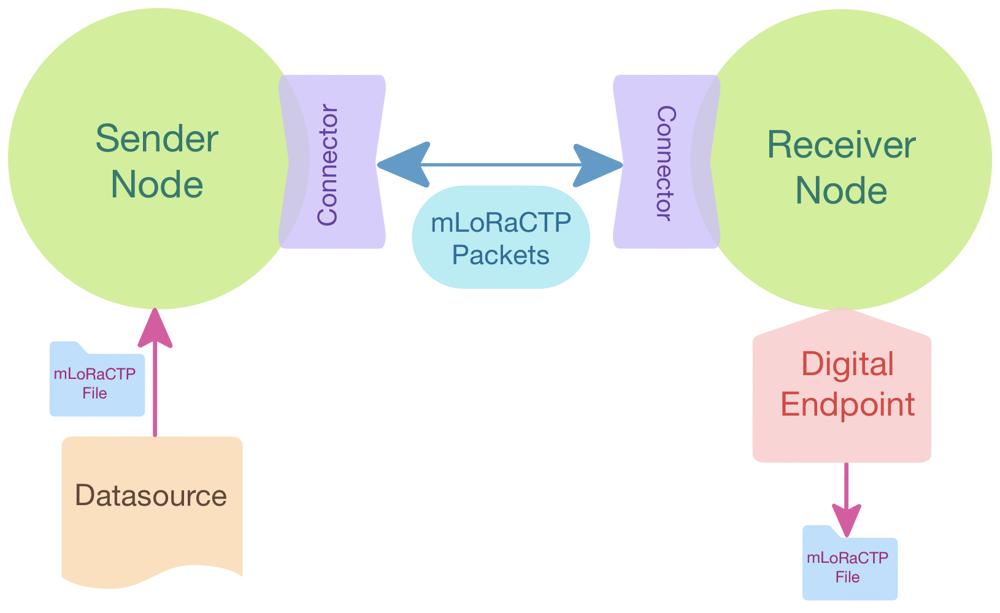
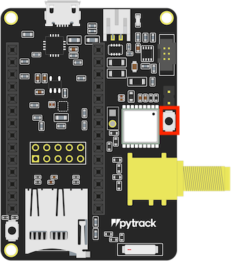

# ****AlLoRa:**** modular, mesh, multi-device ****LoRa Content Transfer Protocol****


<p align="center">
    
</p>

The code in this repository contains a toolbox that allows transferring content over a LoRa channel. It’s based on the original [LoRaCTP](https://github.com/pmanzoni/loractp), adding a more modular design with mesh capabilities and larger packet sizes for faster transfers. 

~~Details of the protocol can be found in this paper: (soon)~~

## Readme on Notion!
> For a better experience, you can check our awesome **Notion** description of the code [here...](https://www.notion.so/barratia/m3LoRaCTP-ec6d1adaabcb44b39bb59d41bdf75b9b)

## Content
- [Folders](#folders)
  - [AlLoRa](#AlLoRa)
    - [Nodes](#nodes)
      - [Node.py](#base_nodepy)
      - [Sender.py](#sender_nodepy)
      - [Receiver.py](#receiver_nodepy)
      - [Gateway.py](#gateway_nodepy)
    - [Connectors](#connectors)
    - [→ Datasource.py](#datasourcepy)
    - [→ Digital_Endpoint.py](#digital_endpointpy)
    - [→ File.py](#-AlLoRa_filepy)
    - [→ Packet.py](#-AlLoRa_packetpy)
  - [Adapters](#adapters)
    - [AlLoRa-WiFi_adapter](#AlLoRa-wifi_adapter)
  - [Examples](#examples)
- [How does it work?](#how-does-it-work)
  - [→ Communication logic](#-communication-logic)
  - [→ Packet Structure](#-packet-structure)
    - [Flag composition](#flag-composition)
  - [→ Mesh mode](#-mesh-mode)
  - [→ Debug Hops](#-debug-hops)
- [Running an example](#running-an-example)
    - [Hardware Requirements](#hardware-requirements)
    - [Setup](#setup)

# Folders

## **AlLoRa**


<details>
<summary>It contains all the code necessary to setup a communication network between devices, from a point-to-point using two LoPy4’s, to a mesh with a gateway and multiple edge-nodes.</summary>
    
### [Nodes](https://github.com/SMARTLAGOON/AlLoRa/tree/main/AlLoRa/Nodes)

<details>
<summary>A node is the element in charge of managing the communication logic for the Content Transfer Protocol.</summary>

  ### [Node.py](https://github.com/SMARTLAGOON/AlLoRa/blob/main/AlLoRa/Nodes/Node.py)

  It is the parent class from whom the other nodes inherits them base and common attributes and methods.
  It receives a boolean to indicate if the system is working on **mesh mode** or not and a **[Connector](https://www.notion.so/AlLoRa-ec6d1adaabcb44b39bb59d41bdf75b9b).**

  The Base Node is not supposed to be instantiated, it acts like an abstract class for the other Nodes (MicroPython doesn't support abstract classes, so we used a Parent class instead...)

  The main methods in this class are send_request and send_response.

  ### [Sender.py](https://github.com/SMARTLAGOON/AlLoRa/blob/main/AlLoRa/Nodes/Sender.py)

  It is a structure whose purpose, as its name implies, is to send one or more [Files](https://www.notion.so/AlLoRa-ec6d1adaabcb44b39bb59d41bdf75b9b) . It waits and listens for requests from a [Receiver](https://www.notion.so/AlLoRa-ec6d1adaabcb44b39bb59d41bdf75b9b) or [Gateway](https://www.notion.so/AlLoRa-ec6d1adaabcb44b39bb59d41bdf75b9b) Node and syncs with them to send blocks (we call them chunks) of bytes of a [File,](https://www.notion.so/AlLoRa-ec6d1adaabcb44b39bb59d41bdf75b9b)  until it finishes and is ready to send another one.  

   <details>
   <summary><b><u>Usage</u></b></summary>

   ### [Sender](https://github.com/SMARTLAGOON/AlLoRa/blob/ModuLoRa/AlLoRa/Nodes/Sender.py) usage:
   1. Instantiation:

      For the user, the Sender must be instantiated with the same parameters explained in [Node](https://www.notion.so/AlLoRa-ec6d1adaabcb44b39bb59d41bdf75b9b), plus:

      -name: A nickname for the Node, it shouldn’t be too large, we recommend a maximum of 3 characters, for the testing we used one letter (Nodes “A”, “B”, “C”…)
      
      -chunk_size (optional): It is the size of the payload of actual content to be sent in each [Packet](https://www.notion.so/AlLoRa-ec6d1adaabcb44b39bb59d41bdf75b9b). The maximum and default chunk_size is 235 for p2p mode and 233 for mesh mode, but if for some reason the user prefers to make it smaller, this is the parameter to change.

 2. Establish Connection: 

    The first thing to do with the Sender is to use the establish_connection method. It will wait until a message for itself arrives, in order to sync with the Receiver/Gateway Node.

 3. Set a File:

    Now, we can start using the Node to send [Files](https://www.notion.so/AlLoRa-ec6d1adaabcb44b39bb59d41bdf75b9b). For this, we use the set_file method, that receives a previously instantiated object of the class [File](https://www.notion.so/AlLoRa-ec6d1adaabcb44b39bb59d41bdf75b9b) (more about it above…). Another way to set a file to sent is with the restore_file method, but this is only supposed to be used when the code had some type of interruption, and we need to continue sending a File “mid-chunk”.

 4. Send the File:

    After this, we call the send_file method, and it will manage the transfer of all the chunks  of the File to be sent.


 ### Example:

 ```python
 from AlLoRa.Nodes.Sender import ASender

 lora_node = AlLoRa_Sender(name = "A", connector = connector,
          chunk_size = 235, mesh_mode = True, debug = False)

 lora_node.establish_connection()
 lora_node.set_file(file_to_send)
 lora_node.send_file()
 ```
 </details>

 ### [Receiver.py](https://github.com/SMARTLAGOON/AlLoRa/blob/main/AlLoRa/Nodes/Receiver.py)

 It is a structure whose purpose, as its name implies, is to receive [Files](https://www.notion.so/AlLoRa-ec6d1adaabcb44b39bb59d41bdf75b9b). It asks information to a [Sender](https://www.notion.so/AlLoRa-ec6d1adaabcb44b39bb59d41bdf75b9b)  and listens for the responses. In order to communicate with an specific Node, the Receiver must have the information of this endpoint, for this,  we use the [Digital_Endpoint](https://www.notion.so/AlLoRa-ec6d1adaabcb44b39bb59d41bdf75b9b) class, who contains the MAC Address of the endpoint and manages the states of the communication and generates the complete [File](https://www.notion.so/AlLoRa-ec6d1adaabcb44b39bb59d41bdf75b9b) when the receiver finishes collecting all the chunks.

 <details>
 <summary><b><u>Usage</u></b></summary>

 ### [Receiver](https://www.notion.so/AlLoRa-ec6d1adaabcb44b39bb59d41bdf75b9b) usage:

 1. Instantiation:

 For the user, the Receiver must be instantiated with the same parameters explained in [Node](https://www.notion.so/AlLoRa-ec6d1adaabcb44b39bb59d41bdf75b9b), plus:

- debug_hops (optional):  If True, the Senders will override the message to be sent and register the message path (or hops between Nodes), more information about this [here](https://www.notion.so/AlLoRa-ec6d1adaabcb44b39bb59d41bdf75b9b).
- NEXT_ACTION_TIME_SLEEP (optional): Is the time (in seconds) between actions for the receiver in order to listen to the sender. The default is 0.1 seconds, but you can experiment with this number if you want.
2. Listen to endpoint:

    Once instantiated, we can use the method listen_to_endpoint, who needs a [Digital_Endpoint](https://www.notion.so/AlLoRa-ec6d1adaabcb44b39bb59d41bdf75b9b) to operate and a listening_time. We can use a loop to ensure that the [File](https://www.notion.so/AlLoRa-ec6d1adaabcb44b39bb59d41bdf75b9b) to be received arrives completely, but we can also use this listening_time to avoid getting stuck for too long while waiting for it to arrive.


### Example:

```python
from AlLoRa.Nodes.Receiver import Receiver

lora_node = Receiver(connector = connector, mesh_mode = True, debug = False)

lora_node.listen_to_endpoint(digital_endpoint, 300)

#We can access the file like this:
ctp_file = digital_endpoint.get_current_file()
content = ctp_file.get_content()
```
</details>

### [Gateway.py](https://github.com/SMARTLAGOON/AlLoRa/blob/main/AlLoRa/Nodes/Gateway.py)

It is a practically a [Receiver Node](https://www.notion.so/AlLoRa-ec6d1adaabcb44b39bb59d41bdf75b9b) (actually, it inherits from it) but it has the capability to manage multiple [Sender Nodes](https://www.notion.so/AlLoRa-ec6d1adaabcb44b39bb59d41bdf75b9b), receiving a list of [Digital_Endpoints](https://www.notion.so/AlLoRa-ec6d1adaabcb44b39bb59d41bdf75b9b)  to check.
 <details>
 <summary><b><u>Usage</u></b></summary>

### [Gateway](https://www.notion.so/AlLoRa-ec6d1adaabcb44b39bb59d41bdf75b9b) usage:

1. Instantiation:

    For the user, the Gateway must be instantiated with the same parameters explained in [Receiver](https://www.notion.so/AlLoRa-ec6d1adaabcb44b39bb59d41bdf75b9b) plus:

    - TIME_PER_ENDPOINT: Time in seconds to focus per Node to listen, the default is 10 seconds.
2. Set list of [Digital_Endpoints](https://www.notion.so/AlLoRa-ec6d1adaabcb44b39bb59d41bdf75b9b):

    Create the necessary [Digital_Endpoints](https://www.notion.so/AlLoRa-ec6d1adaabcb44b39bb59d41bdf75b9b) to listen, add them to a list and give it to the Node with the set_digital_endpoints method

3. Check them:

    Finally, execute the check_digital_endpoints method in order to listen all the nodes, each at a time, for the time that you indicated. This function contains a While True loop, because it’s supposed to keep listening periodically to the Nodes, so be careful when using it!


### Example:

```python
from AlLoRa.Nodes.Gateway import Gateway

lora_node = AlLoRa_Gateway(mesh_mode = True, debug_hops = False, connector = connector)

lora_gateway.set_digital_endpoints(list_of_digital_endpoints)
lora_gateway.check_digital_endpoints()    # Listening for ever...
```

</details>      
    
</details>    
    
### [Connectors](https://github.com/SMARTLAGOON/AlLoRa/tree/main/AlLoRa/Connectors)
    
<details>
<summary>A connector is the element that gives and manages the access to LoRa to a Node. The main objective of the connector is to make AlLoRa available to as many type of devices as possible. Many devices have embedded LoRa capabilities, while others maybe not, so the connector is a class that acts as a bridge to LoRa.</summary>
        
### [Connector.py](https://github.com/SMARTLAGOON/AlLoRa/blob/main/AlLoRa/Connectors/Connector.py)

It is the parent class from whom the connectors inherits them base attributes and methods.

It manages the methods to send and receive data using raw LoRa, gives access to the RSSI of the last received package and the MAC address of the device. It also contains the method send_and_wait_response, whose function is to send a packet (usually with a request) and wait for a predefined period of time (WAIT_MAX_TIMEOUT).

### [LoPy4_connector.py](https://github.com/SMARTLAGOON/AlLoRa/blob/main/AlLoRa/Connectors/LoPy4_connector.py)

This type of connector is very straightforward, it uses the native library for using LoRa from the LoPy4 (Only tested in LoPy4)

### [SX127x_connector](https://github.com/SMARTLAGOON/AlLoRa/blob/main/AlLoRa/Connectors/SX127.py)

This connector was developed to use in a Raspberry Pi connected to a Dragino LoRa/HPS HAT for RPi v1.4. It uses the SX127x library to manage the Raspberry Pi’s GPIOs in order to control the Dragino and send packages using a LoRa channel. It also works with ESP32 that uses the SX127x.

### [Wifi_connector.py](https://github.com/SMARTLAGOON/AlLoRa/blob/main/AlLoRa/Connectors/Wifi_connector.py)

Is the counterpart of the [AlLoRa-WiFi_adapter](https://github.com/SMARTLAGOON/AlLoRa/blob/main/AlLoRa-Adapters),  developed to use in a Raspberry Pi, but also tested on computers running macOS and Windows. 

</details>
    
### → [Datasource.py](https://github.com/SMARTLAGOON/AlLoRa/blob/main/AlLoRa/DataSource.py)

A Datasource is a handy class that can be use to manage the files to be send. It is supposed to be used to feed Files to send to a Sender Nodes.

### → [Digital_Endpoint.py](https://github.com/SMARTLAGOON/AlLoRa/blob/main/AlLoRa/Digital_Endpoint.py)

Contains the MAC Address of the endpoint to communicate with and manages the states of the communication. It also manages the generation of the complete [File](https://www.notion.so/AlLoRa-ec6d1adaabcb44b39bb59d41bdf75b9b) when the receiver finishes collecting all the chunks.

It also manages the “state” or phase in which the transfer is. 

### → [AlLoRa_File.py](https://github.com/SMARTLAGOON/AlLoRa/blob/main/AlLoRa/AlLoRa_File.py)

It is the class who focus on the actual File to be sent or received. It can be used to obtain the chunks of the content to transfer to the Sender Nodes and also assembly all the blocks received to obtain the complete File in the Receiver/Gateway side.

It can be instantiated with content (byte array) to be used by the Sender to transmit the content, or it can also be instantiated as a “container”, in order to receive the chunks and finally assemble it to obtain the whole content, in the Receiver side.

### → [AlLoRa_Packet.py](https://github.com/SMARTLAGOON/AlLoRa/blob/main/AlLoRa/AlLoRa_Packet.py)

This class structures the actual packet to be sent through LoRa. It manages the creation of the message to be sent and also is capable of load the data received by LoRa in order to check that the message was correctly received (with checksum). 
It is composed by a header and the actual payload. 

More details about the structure of the packages [here](https://www.notion.so/AlLoRa-ec6d1adaabcb44b39bb59d41bdf75b9b).

</details>

## Adapters

<details>
<summary>Sometimes another device is needed in order to bridge to LoRa, depending of the technology used for the connection. In this cases, the code for the adapters will be in this folder, for now we have a WiFi to LoRa adapter</summary>

### [AlLoRa-WiFi_adapter](https://github.com/SMARTLAGOON/AlLoRa/tree/main/AlLoRa-Adapters/AlLoRa-WiFi_adapter)

It contains the code for a LoPy4. It activates a hotspot for the Node to be bridged to connect to and a “light version” of a mix of the code of a Node and a Connector.  

It operates in this way:

🍓 Raspberry Pi/Computer Node (Wifi Connector) **←Wi-Fi→** LoPy4 with AlLoRa-WiFi_adapter **←LoRa→** Node


<details>
<summary><b><u>Setup Lopy4 Adapter</u></b></summary>

1. Setup the LoPy4 (following this [instructions](#setup)).
2. Uploading and running the code
   
   1. Open the [AlLoRa-WiFi_adapter](https://github.com/SMARTLAGOON/AlLoRa/tree/main/AlLoRa-Adapters/AlLoRa-WiFi_adapter) folder of the repo in your IDE
   2. Connect your LoPy4 + expansion board to your computer. PyMakr should recognise it and show you something like this:

        

        - If it doesn’t do it automatically, you can open the “Connect Device” option and manually select your Port:

            <p align="center">
            
            </p>

   3. Open the config.txt file and setup a SSID and Password for the Lopy4's Wi-Fi hotspot, you will use this to connect to the adapter with the device that you are connecting to LoRa through this adapter.

   4. Press Ctrl+Alt/Opt + s or the “Upload Project to Device” button to upload the code to the LoPy4

     

     With this, the code will boot automatically each time the LoPy4 is on.

   5. If everything is ok, you should see something like this on the terminal:

     <p align="center">
    
    </p>

   6. Import and setup a [Wifi_connector.py](https://github.com/SMARTLAGOON/AlLoRa/blob/main/AlLoRa/Connectors/Wifi_connector.py) in the device that you want to communicate using AlLoRa, and then use the rest of the library as explained in this repo. Your device should be connected to the Adapter's hotspot and everything should work as normal. 

 </details>

</details>

## Examples

<details>
<summary>Contain examples of uses of the AlLoRa code.</summary>

### [LoPy Sender](https://github.com/SMARTLAGOON/AlLoRa/tree/main/examples/LoPySender)

A simple implementation of a Sender Node use case, it sends increasingly larger files of numbers.

### [LoPy Receiver](https://github.com/SMARTLAGOON/AlLoRa/tree/main/examples/LoPyReceiver)

A simple implementation of a Receiver Node use case, it ask a Sender Node for information and listen to the responses

### [Raspberry Gateway](https://github.com/SMARTLAGOON/AlLoRa/tree/main/examples/RaspberryGateway)

An implementation of a Gateway Node using Raspberry Pi (or a desktop computer), it access LoRa using the [AlLoRa-WiFi_adapter](https://github.com/SMARTLAGOON/AlLoRa/tree/main/AlLoRa/Adapters/AlLoRa-WiFi_adapter) and listens to two Sender Nodes and prints the content when a whole File is received.

</details>

# **How does it work?**

<p align="center">
  
</p>

As we can see in the image above, the protocol is structured in a symmetrical way. At the left we have the Sender side, with a [Sender Node](https://www.notion.so/AlLoRa-ec6d1adaabcb44b39bb59d41bdf75b9b)  that receives a [AlLoRa File](https://www.notion.so/AlLoRa-ec6d1adaabcb44b39bb59d41bdf75b9b)  to be sent from a [Data Source](https://www.notion.so/AlLoRa-ec6d1adaabcb44b39bb59d41bdf75b9b), and uses a [Connector](https://www.notion.so/AlLoRa-ec6d1adaabcb44b39bb59d41bdf75b9b) to access LoRa to send [AlLoRa Packets](https://www.notion.so/AlLoRa-ec6d1adaabcb44b39bb59d41bdf75b9b). 

At the right we have the Receiver side, with a [Receiver Node](https://www.notion.so/AlLoRa-ec6d1adaabcb44b39bb59d41bdf75b9b) that receives a [Digital Endpoint](https://www.notion.so/AlLoRa-ec6d1adaabcb44b39bb59d41bdf75b9b), that provides the Sender information, in order to listen to it to receive the [AlLoRa File](https://www.notion.so/AlLoRa-ec6d1adaabcb44b39bb59d41bdf75b9b), it also uses a [Connector](https://www.notion.so/AlLoRa-ec6d1adaabcb44b39bb59d41bdf75b9b) to access LoRa to receive the [AlLoRa Packets](https://www.notion.so/AlLoRa-ec6d1adaabcb44b39bb59d41bdf75b9b), that contains the chunks (blocks of bytes) of the content transmitted.

## → Communication logic

The system follow a logic of requests from the Receiver to the Sender. Depending of the state of the state of the [Digital Endpoint](https://www.notion.so/AlLoRa-ec6d1adaabcb44b39bb59d41bdf75b9b), the Receiver will send requests to the specific Sender and wait a time for an answer or reply. If the answer does not arrive or it arrives with corruptions, the Receiver Node will repeat the request until the message arrives correctly (with a timeout when necessary).

The [Digital Endpoints](https://www.notion.so/AlLoRa-ec6d1adaabcb44b39bb59d41bdf75b9b) operates with the following states or phases of the communication:


1. **Establish connection**
    
    Every Digital Endpoint start in this state, is sends a simple packet with the command “ok” and waits until a “ok” from the sender is received, then, it continues to the next state. 
    
2. **Ask metadata**:
    
    This is the first step for receiving a [AlLoRa File](https://www.notion.so/AlLoRa-ec6d1adaabcb44b39bb59d41bdf75b9b), it asks the Sender for the metadata of the content to be received and waits until a Packet arrives with the name and the number of chunks of the content. In this stage, the [Digital Endpoint](https://www.notion.so/AlLoRa-ec6d1adaabcb44b39bb59d41bdf75b9b) creates an empty [AlLoRa File](https://www.notion.so/AlLoRa-ec6d1adaabcb44b39bb59d41bdf75b9b) object that will act as a container for the incoming chunks. If successful, it continues to the next state.
    
3. **Ask for data**
    
    In this state, the Receiver will sequentially ask for the chunks necessary to obtain the whole content. When a chunk arrives, it will feed the [AlLoRa](https://www.notion.so/AlLoRa-ec6d1adaabcb44b39bb59d41bdf75b9b) object until it collected all. When the [AlLoRa File](https://www.notion.so/AlLoRa-ec6d1adaabcb44b39bb59d41bdf75b9b) is complete, it will be assembled and the content will be ready to access or saved.
    
4. **Final acknowledge**
    
    In order to maintain the synchronization between the Nodes, a final acknowledge will be sent, and the system will wait until the Sender replies with an “ok” command.

**More information about how the [commands work](https://www.notion.so/AlLoRa-ec6d1adaabcb44b39bb59d41bdf75b9b) in the Packet Structure section*

## → Packet Structure

The  [Packet](https://github.com/SMARTLAGOON/AlLoRa/blob/ModuLoRa/AlLoRa/Packet.py) is the element that is sent and receive through LoRa. It is designed to maximize the amount of actual content (or chunk size) sent each time, but also to ensure the correct reception of the package by the Node that is supposed to receive it. 

For compatibility’s sake, It is designed to have a maximum of 255 Bytes, that is the maximum size of a LoRa message on a LoPy4.

The header size is variable depending on the enabled mode (mesh or point-2-point), but both have in common a header of 20 Bytes, the first 16 Bytes contain the first 8 characters of the MAC Address of the source and destination Nodes. 1 Byte is destined to the message’s command and flags (explained in more detail [below](https://www.notion.so/AlLoRa-ec6d1adaabcb44b39bb59d41bdf75b9b)). Another 3 Bytes are destined to the Checksum of the content, it is used to check if the content has arrived correctly or if it has some type of corruption. 

Finally, if the system is working in [Mesh mode](https://www.notion.so/AlLoRa-ec6d1adaabcb44b39bb59d41bdf75b9b) (detailed below), an additional 2 Bytes are used to store a message ID. The ID is a random number between 0 and 65.535 (the range of values that can be represented in binary using 2 Bytes) and it is used to manage the retransmissions when in mesh mode and to avoid chunk duplication in the receiver.

<div align="center">
<table>
<tr>
<th>Point-2-point Packet</th>
<th>Mesh Packet</th>
</tr>
<tr>
<td>
<pre>

</pre>
</td>
<td>

</td>
</tr>
</table>
</div>

With this, the point-2-point Packet has 235 Bytes maximum for its payload, while the mesh Packet has 233 available Bytes. It seems like a small difference, but with 255 Bytes maximum per Packet, every Byte counts when sending Kilobytes of data.

### Flag composition

The Flag Byte is structured as follows:

<p align="center">
  
</p>


- **Command bits**: 2 bits that combined represent one of four type of commands:
    
    - **00 → DATA:** The command activated when the payload contains a requested chunk.
    - **01 → OK:** The acknowledgement command, it is used to establish connection between nodes or notify of the correct reception of the final chunk of the content being received. It usually implies that the payload is empty.
    - **10 →  CHUNK:** This command is used by the Receiver/Gateway to ask for a chunk of the content being received. The chunk number is stored in the payload, so the Sender can know what block is being requested.
    - **11 → METADATA:** This command is used by the Receiver/Gateway to ask for the metadata of the file to be received. If this is the case, the payload of the request will be empty. It is also used by the Sender to answer the request of metadata. In this case the payload contains the name and size of the File to sent.
- **Retransmission bit**: Not being used for the moment
    
- **Mesh bit**: 1 bit that indicates if the message is supposed to be forwarded or not (more about this in the [Mesh mode](https://www.notion.so/AlLoRa-ec6d1adaabcb44b39bb59d41bdf75b9b) segment).
    
- **Hop bit**: 1 bit that is True if the message was forwarded at some point (more about this in the [Mesh mode](https://www.notion.so/AlLoRa-ec6d1adaabcb44b39bb59d41bdf75b9b) segment).
    
- **Debug hop bit**: 1 bit that indicates that the message in question is in “debug hop mode” (more about this in the [Debug hops](https://www.notion.so/AlLoRa-ec6d1adaabcb44b39bb59d41bdf75b9b) segment).
    

## → Mesh mode

If the communication protocol has the mesh mode activated, the communication will work exactly the same as described [before](https://www.notion.so/AlLoRa-ec6d1adaabcb44b39bb59d41bdf75b9b), but in the case of a request don’t being answered by a Sender for a specific number of times (set by the user), the [Digital Endpoint](https://www.notion.so/AlLoRa-ec6d1adaabcb44b39bb59d41bdf75b9b) will jump to “retransmission mode”. Activating the mesh bit in the Packet in order to tell the other Nodes in the system to retransmit the message if received, to extend the reach of the system and try to establish the communication with the missing Node.

If a Sender Node receives a Packet that is not for itself, it usually discards it and keep listening for request directed to it. But with the mesh bit activated, it will forward it to help reach the real destination. For this forwarding, the Node sleeps for a random time between 0.1 and 1 second before sending it. This reduces the possibility of collisions between Packets when multiple Nodes are active and in reach between them. Each time a Packet is forwarded, the Hop bit of it will be activated in order to announce that it actually went through other devices during its path. When the destination Node receives its message, it notices that the message arrived using the “retransmission mode” and creates a response Packet with the mesh bit activated, because it assumes that if it arrived like this, it is probably that the response will reach the Gateway jumping through the same path. In this case, the Node doesn’t sleep before sending the response, prioritizing always the sender Node being requested something.

If the response Packet arrives with the Hop bit off to the Gateway, it means that it didn't go through any other Node in order response to the request, indicating that the retransmission maybe are not needed. In this cases the Gateway will deactivate the “retransmission mode” of this specific Digital Endpoint.

In order to avoid duplication and over retransmission of messages that could collapse the system, each new Packet is assigned a random ID by the Node, and is saved in a fixed-size list that is checked wherever a new message with mesh bit activated arrives. The Nodes also have another fixed-size list that saves all the forwarded message’s IDs and that checks to avoid forwarding multiple times the same Packet.

## → Debug Hops

The debug hops is an option available to activate when instantiating a Receiver or Gateway Node, and is a useful tool to check the path of a Packet when using the Mesh mode. It overrides the messages and focus on register in the payload each time the Packet goes through a Node. This information can be later retrieved in the Receiver/Gateway Node’s device’s memory and can be used to make decisions about the distribution of the Nodes in the area to cover.

The output of this process generates a log_rssi.txt file that looks like this:

```
022-06-17_17:11:40: ID=24768 -> [['B', -112, 0.5], ['A', -107, 0], ['B', -106, 0.3], ['C', -88, 0.2], ['G', -100, 0]]
2022-06-17_17:11:50: ID=2065 -> [['C', -99, 0.4], ['B', -93, 0], ['C', -93, 0.2], ['G', -105, 0]]
2022-06-17_17:11:53: ID=63728 -> [['C', -100, 0.4], ['B', -95, 0], ['C', -95, 0.5], ['G', -103, 0]]
2022-06-17_17:11:54: ID=32508 -> [['B', -114, 0], ['C', -95, 0.4], ['G', -103, 0]]
2022-06-17_17:11:56: ID=10063 -> [['C', -99, 0.1], ['B', -95, 0], ['C', -94, 0.1], ['G', -103, 0]]
```

Where it shows the time of reception, the ID of the message and then a list of hops that the Packet did. Each hop saves the  name of the Node, the RSSI of the last package received with LoRa when registering the hop, and the random time that the Node had to wait before forwarding the message. As we can see, in some cases this random sleep is 0. This is not random, because those Nodes were the destination of the requests of the Gateway, and, as commented before, they have the priority.

# Running an example

### Hardware Requirements

- [Raspberry Pi 4](https://www.raspberrypi.com/products/raspberry-pi-4-model-b/)
- [Lopy4](https://pycom.io/product/lopy4/) with an expansion board like:
  - [Pysense 2.0 X](https://pycom.io/product/pysense-2-0-x/)
  - [Pygate 868](https://pycom.io/product/pygate/)

### Setup:

In order to run an example, if you are using a Python compatible device, you should install the latest version of the AlLoRa library. If your device has MicroPython support (like the LoPy4), we recommend copy the AlLoRa folder of this repo directly into your device.

<details>
 <summary><b><u>Setup a LoPy4</u></b></summary>
   
*   <details>
    <summary><b>1. Updating the expansion boards (Pysense 2.0 X or Pygate)</b></summary>
 
    
    Follow this: [Updating Expansion Board Firmware](https://docs.pycom.io/chapter/pytrackpysense/installation/firmware.html)
    * <details>
      <summary><b><i>TL;DR ⚡ </i></b></summary>

      >    
      > ⚠️ You should remove the LoPy4 from the board for this step, we are only working with the Pysense 2 or the Pygate
      >

        1. Download this:

            • **[Pysense 2 DFU](https://software.pycom.io/findupgrade?key=pysense2.dfu&type=all&redirect=true)**

            • **[Pygate](https://software.pycom.io/findupgrade?key=pygate.dfu&type=all&redirect=true)**

        2. Install dfu-util:
            - MacOs

                ```bash
                brew install dfu-util
                ```

            - Linux

                ```bash
                sudo apt-get install dfu-util
                ```

            - Windows

                Harder, follow the [official explanation](https://docs.pycom.io/chapter/pytrackpysense/installation/firmware.html) or check-out this video:

                [https://www.youtube.com/watch?v=FkycTZvj-ss](https://www.youtube.com/watch?v=FkycTZvj-ss)

        3. Use dfu-util to update each expansion board

            Write this in the terminal

            - MacOs and Linux
                - Update Pysense 2:

                    ```bash
                    sudo dfu-util -D pysense2_v16.dfu #This name will change with new versions, match it...
                    ```

                - Update Pygate:

                    ```bash
                    sudo dfu-util -D pygate_v13_1049665.dfu #This name will change with new versions, match it...
                    ```

            - Windows
                - Update Pysense 2:

                    ```bash
                    dfu-util-static.exe -D #This name will change with new versions, match it...
                    ```

                - Update Pygate:

                    ```bash
                    dfu-util-static.exe -D #This name will change with new versions, match it...
                    ```


            Connect the expansion board to your computer while pressing the DFU button (toggle to check where it is depending of the board...)

            - Pysense 2

                

            - Pygate

                


            Wait 1 second, release the DFU button and press enter in the terminal to run the code.

            As a result, you should expect something like this:

            

        4. Check it with:

            ```bash
            lsusb
            ```

            You should expect something like this:

            ```bash
            Bus 000 Device 001: ID 04d8:f012 Microchip Technology Inc. Pysense  Serial: Py8d245e
            ```
    </details>
*   <details>
    <summary><b>2. Update the Lopy4 </b></summary>
 

    1. Download the Pycom Firmware Tool from: [Updating Device Firmware](https://docs.pycom.io/updatefirmware/device/)

    2. Download this legacy firmware: [LoPy4-1.19.0.b4.tar.gz](https://software.pycom.io/downloads/LoPy4-1.19.0.b4.tar.gz)
        - (You can find it here) [Firmware Downgrade](https://docs.pycom.io/advance/downgrade/)

    3. Connect each LoPy4 to it’s respective Expansion Board (The LED side of the LoPy should be facing the USB port of the expansion board) ant then plug it on your computer
    4. Open Pycom Firmware Tool and press continue 2 times to get to the “Communication” section
    5. Select the port and the speed (for me 115200 worked ok), select the “Show Advanced Settings” checkbox and select “Flash from local file” and locate the firmware that we downloaded a few steps before (LoPy4-1.19.0.b4.tar.gz).
    6. Select the Erase flash file system and Force update LoRa region and press continue
    7. In the LoRa region selection select your country or region to establish your LoRa frequency.
    8. Press “Done” and it should start updating
    9. Repeat this step with the other LoPy4 with it’s respective expansion board...
    </details>

*   <details>
    <summary><b>3. Setting the environment</b></summary>

    Here is the official [documentation](https://docs.pycom.io/gettingstarted/software/) for this step.

    We’ll need to upload the programs using PyMakr, a library that can be installed into [VS Code](https://code.visualstudio.com/) and [Atom](https://atom.io/) (I will refer to them as [IDE](https://en.wikipedia.org/wiki/Integrated_development_environment))

    
    > ⚠️ I personally used an M1 Pro Macbook Pro and Atom with PyMakr and it worked fine for me.


    - Here is the official Pycom guide to using Atom + PyMakr: [Atom](https://docs.pycom.io/gettingstarted/software/atom/)

    - If you want to use VS Code, here are the official Pycom instructions: [Visual Studio Code](https://docs.pycom.io/gettingstarted/software/vscode/)


    Once you have everything installed and working, you should be able to connect your LoPy4 + expansion board (Pygate  and Pysense 2.0 X for the sender and the receiver respectively) to your computer using an USB cable and PyMakr should recognise it.
    </details>

*   <details>
    <summary><b>4. Uploading and running code</b></summary>
   
       1. Open the folder of the example you want to run in the LoPy4 in your IDE
       2. Connect your LoPy4 + expansion board to your computer. PyMakr should recognise it and show you something like this:
        
    <p align="center">
     
    </p>

     - If it doesn’t do it automatically, you can open the “Connect Device” option and manually select your Port:

     <p align="center">
     
     </p>

       3. Press Ctrl+Alt/Opt + s or the “Upload Project to Device” button to upload the code to the LoPy4

    

    With this, the code will boot automatically each time the LoPy4 is on.

       4. If everything is ok, you should see something like this on the terminal:

    <p align="center">
    
    </p>

</details>

</details>

<details>
 <summary><b><u>Raspberry Pi 4 as a Gateway</u></b></summary>

1. Setup your Raspberry Pi 4 with [Raspberry Pi OS 32bit](https://www.raspberrypi.com/software/) and [install Python 3.8.](https://itheo.tech/install-python-38-on-a-raspberry-pi)
2. Setup an [adapter](#adapters) to give access to the Raspberry Pi to LoRa.
3. Download the [RaspberryGateway](https://github.com/SMARTLAGOON/AlLoRa/examples/RaspberryGateway) example and execute it.

</details>
