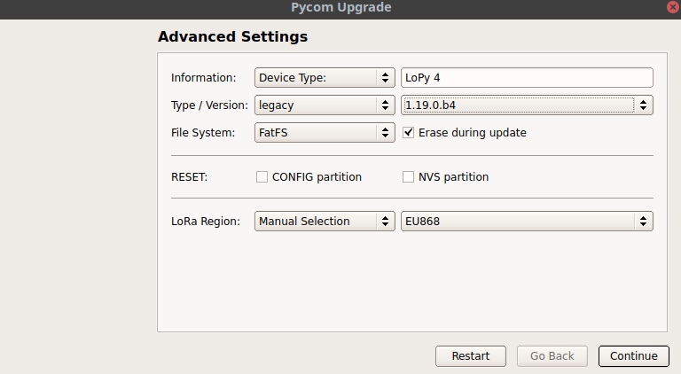
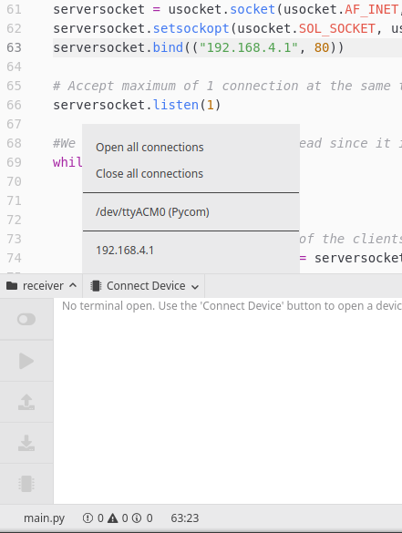
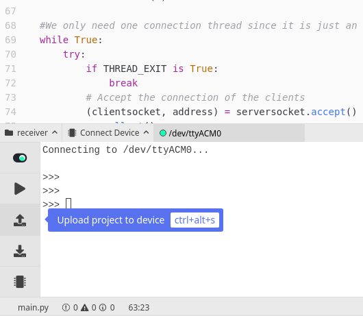

# BuoySoftware
This repo contains the software to send data from the SMARTLAGOON buoy to a server. It is a scalable LoRa based protocol.

## Purposes
Having a buoy placed on a lagoon, the sending part which is composed by one Pycom Lopy 4 over Pybytes board is connected inside it, along with a commercial datalogger (SENDER).

In the shore another Pycom Lopy 4 (RECEIVER) attached to one Raspberry Pi (rpi_receiver) along with its corresponding node, are placed. It handles and processes the received data.

## How does it work?
Many things happen at the same time, let us break it down.

### Sender
The sender has a non-ending loop looking for new data from the datalogger, which are intended to be collected through its Ethernet port, perhaps accessing in standalone mode to its API (under development).

It also has another non-ending loop awaiting for those data to be requested over LoRa by the receiver.

### Receiver
The receiver runs an HTTP API which serves as a LoRa dispatcher between buoy senders and rpi_receiver. It broadcasts over LoRa all the commands that rpi_receiver sends to its HTTP API. In other words, the receiver acts as a LoRa capabilities access intermediary for the rpi_receiver.

Receiver opens a Wi-Fi hotspot for the rpi_receiver to get connected in.

### Rpi_receiver
The rpi_receiver gets connected to the receiver's Wi-Fi hotspot. It holds all the communicating logic. It runs a simplistic protocol where all the senders are iterated for being requested for its new data.
The protocol messages are exchanged in this way:

(*) {} means a gap to be filled with concrete information.

"MAC:::{};;;COMMAND:::request-data-info" is sent to receiver over HTTP and receiver forwards over LoRa the same message; sender checks if MAC matches with its own MAC and sends a reply backwards; receiver re-checks whether MAC matches and sends back the sender's reply to rpi_receiver. This reply contains some metadata info about the data itself such as filename, number of chunks that make up the whole file and so on.

Once the rpi_receiver knows those metadata, it elaborates a bunch of requests until all the chunks are received. This requests are sent in the same way as the previous ones are. The subsequent requests meet this format "MAC:::{};;;COMMAND:::chunk-{}".

When rpi_receiver has finished fetching all the chunks, it reassembles and saves the data file and the process starts over.

## Running an example
The project structure is divided in three folders:

__sender:__ Pycom Lopy 4 code for buoy side.

__receiver:__ Pycom Lopy 4 code for land side.

__rpi_receiver:__ Raspberry Pi code for land side.

### What are we going to need?

#### Devices:
- x2 Pycom Lopy4 devices with their USB cables.
- x1 Raspberry Pi with Raspbian 32bit as OS and Python 3.8 installed.

#### Software:
To manipulate Pycom devices will be necessary to install either Visual Studio Code or Atom. _(For this tutorial Atom on Linux was chosen)_
In Atom it is required to install the PyMakr module going to Edit -> Preferences -> Packages.

Pycom Firmware Tool will be useful in cases where Lopy get hanged or simply a firmware customization is required, which will be the case.

For the Raspberry Pi side Pycharm IDE from Jetbrains will be used along with Python 3.8.

### Preparing the Raspberry Pi

Raspberry Pi will be who leads the communications, will be referred as "rpi_receiver" hereinafter.

1. Load the __rpi_receiver__ folder into rpi_receiver.
2. Install Python3.8 dependencies using the command _pip install -r requirements.txt_
3. As rpi_receiver will need to stay connected to two networks, giving one of them Internet connection, Ethernet port will be used to keep rpi_receiver connected to Internet; the built-in Wi-Fi adapter will be used to stay connected to one Lopy 4.

_(Next steps have to wait for Lopy4 to be ready)_
4. Connect rpi_receiver to Lopy4's Wi-Fi hotspot called "smartlagoon". _(Note that both, SSID and key are hardcoded until the date, so looking into receiver/boot.py will reveal the information)_
5. Start the rpi_receiver main.py either using console command _python3.8 main.py_ or pressing Play button in Thonny, the Python editor included in Raspbian.

### Preparing Lopy4 receiver

This Lopy4 will act as a package forwarder between rpi_receiver and buoy senders. Will be called _receiver_ hereinafter.

Assuming Atom with Pymakr module is installed along with Pycom Firmware Tool _(PFT hereinafter)_:

1. It is needed to install the firmware __1.19.0b4(legacy)__ using PFT. As far as I know, Wi-Fi hotspot along with LoRa only works well under this version.

  1.1. Select the serial device port and type "legacy" on the dropdown lists on the PFT startup screen.

  1.2. Check "Erase during update" checkbox and the correct firmware version.

  

2. Ensure your serial communications under Linux works permissionless following [this tutorial](https://websistent.com/fix-serial-port-permission-denied-errors-linux/).

3. Load __receiver__ folder content into Lopy as showed below:

  3.1. Select the serial device.

  

  3.2. Upload the code.

  

The code will start on boot every time you give power to Lopy4.

4. Lopy4 will deploy a Wi-Fi hotspot as mentioned before, now is the moment to connect the rpi_receiver to it, for the rest of times this connection will occur automatically.

### Preparing Lopy4 sender (Buoy)

This Lopy4 will send under demand the data rpi_receiver requests through receiver.

1. Perform the same first step as with the receiver and load the firmware.
2. Load __sender__ folder content into Lopy in the same way as with the receiver.

The code will start on boot every time you give power to Lopy4.

### Running the example

Run the code on rpi_receiver, plug the Lopys and wait. Finally after waiting several seconds, received data will begin to be written inside the __rpi_receiver__ folder under specific folders by sender's MACs.
The received content is saved in folders under the project folder, named by source MAC address.

## rpi_receiver configurations

There are two main configuration files:

### buoy-list.json

Some information about the senders this code is going to communicate with are written here.

Mac address will be used to make requests and the endpoint for uploading the data to a remote server.

    {
      "name": "Boya 1 (Isla del Barón)",
      "lat": 37.6996,
      "lon": -0.7858,
      "alt":0,
      "mac_address": "70b3d549909cd59c",
      "uploading_endpoint": ""https://remote-url.com"
    },

### config.ini
    [receiver]
    RECEIVER_API_HOST = 192.168.4.1 # Receiver IP within its network
    RECEIVER_API_PORT = 80
    SOCKET_TIMEOUT = 10 # Use this to adjust the retrying time interval
    COMMAND_RETRY_SLEEP = 5 # After the socket timeout or in case of exception, for how long it has to wait until resend the command.
    SOCKET_RECV_SIZE = 10000 # Packet size buffer (10000 is there for no reason, just a big number)

    [general]
    SYNC_REMOTE_FILE_SENDING_TIME_SLEEP = 5 # Time between requests to uploading endpoint
    SYNC_REMOTE_FILE_SENDING_MAX_RETRIES = 10 # The max amount of retries a file has to be sent before pass to the next.
    NEXT_ACTION_TIME_SLEEP = 1 # The amount of waiting time before switching to other buoy when the last finished its state
    SYNC_REMOTE_DIRECTORY_UPDATE_INTERVAL_SECONDS = 5 # The waiting time between folder passes

## Troubleshooting

If any Lopy gets stuck or hanged during a code upload or whatever, use the PFT repeating the steps for loading the firmware, it will wipe out the content of the device.

## Caveats

- In case of a fresh start was desired. Erase all MAC folders in rpi_receiver, also application_backup and logs folders; use PFT for erasing the memory checking the box for that purpose during the firmware upload; load the codes in each device again and run the codes.
- It is recommended to stop the Lopy code gracefully, using Ctrl-C will try to stop the code gracefully plus close the TTY connection in Atom using the switch-like button until it turns red.
- At this moment, due to the lack of datalogger connection, messages are being mocked up.
