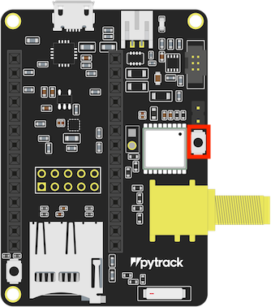

# BuoySoftware
This repo contains the software to send data from the SMARTLAGOON buoy to a server. It is a scalable LoRa based protocol.

## Purposes
Having a buoy placed on a lagoon, the sending part which is composed by one Pycom Lopy 4 over Pybytes board is connected inside it, along with a commercial datalogger (SENDER).

In the shore another Pycom Lopy 4 (RECEIVER) attached to one Raspberry Pi (rpi_receiver) along with its corresponding node, are placed. It handles and processes the received data.

## How does it work?
Many things happen at the same time, let us break it down.

### Sender
The sender has a non-ending loop looking for new data from the datalogger, which are intended to be collected through its Ethernet port, perhaps accessing in standalone mode to its API (under development).

It also has another non-ending loop awaiting for those data to be requested over LoRa by the receiver.

### Receiver
The receiver runs an HTTP API which serves as a LoRa dispatcher between buoy senders and rpi_receiver. It broadcasts over LoRa all the commands that rpi_receiver sends to its HTTP API. In other words, the receiver acts as a LoRa capabilities access intermediary for the rpi_receiver.

Receiver opens a Wi-Fi hotspot for the rpi_receiver to get connected in.

### Rpi_receiver
The rpi_receiver gets connected to the receiver's Wi-Fi hotspot. It holds all the communicating logic. It runs a simplistic protocol where all the senders are iterated for being requested for its new data.
The protocol messages are exchanged in this way:


(*) {} means a gap to be filled with concrete information.

"MAC:::{};;;COMMAND:::request-data-info" is sent to receiver over HTTP and receiver forwards over LoRa the same message; sender checks if MAC matches with its own MAC and sends a reply backwards; receiver re-checks whether MAC matches and sends back the sender's reply to rpi_receiver. This reply contains some metadata info about the data itself such as filename, number of chunks that make up the whole file and so on.

Once the rpi_receiver knows those metadata, it elaborates a bunch of requests until all the chunks are received. This requests are sent in the same way as the previous ones are. The subsequent requests meet this format "MAC:::{};;;COMMAND:::chunk-{}".

When rpi_receiver has finished fetching all the chunks, it reassembles and saves the data file and the process starts over.

# Running an example
> You can also follow this instructions [here...](https://barratia.notion.site/BuoySoftware-Hardware-Setup-078125eb60f94dcdb6abdb86607a1fb2)

### Hardware Requirements

- [Raspberry Pi 4](https://www.raspberrypi.com/products/raspberry-pi-4-model-b/)
- 2 [Lopy4](https://pycom.io/product/lopy4/)
- [Pysense 2.0 X](https://pycom.io/product/pysense-2-0-x/)
- [Pygate 868](https://pycom.io/product/pygate/)
- [Power over Ehternet (PoE) Adapter](https://pycom.io/product/power-over-ethernet-adapter/)

The project structure is divided in three folders (one per device...):

- __sender:__ Pycom Lopy 4 code for buoy side.

- __receiver:__ Pycom Lopy 4 code for land side.

- __rpi_receiver:__ Raspberry Pi code for land side.


### Setup:

Download the code from [BuoySoftware](https://github.com/SMARTLAGOON/BuoySoftware) or clone the repo.

<details>
<summary><b><u>Lopy4 + Pygate (sender) & Lopy4 + Pysense 2.0 X (receiver)</u></b></summary>

    
*   <details>
    <summary><b>1. Updating the expansion boards (Pysense 2.0 X and Pygate)</b></summary>
 
    
    Follow this: [Updating Expansion Board Firmware](https://docs.pycom.io/chapter/pytrackpysense/installation/firmware.html)

    * <details>
      <summary><b><i>TL;DR ⚡ </i></b></summary>

      >    
      > ⚠️ You should remove the LoPy4 from the board for this step, we are only working with the Pysense 2 and the Pygate
      >

        1. Download this:

            • **[Pysense 2 DFU](https://software.pycom.io/findupgrade?key=pysense2.dfu&type=all&redirect=true)**

            • **[Pygate](https://software.pycom.io/findupgrade?key=pygate.dfu&type=all&redirect=true)**

        2. Install dfu-util:
            - MacOs

                ```bash
                brew install dfu-util
                ```

            - Linux

                ```bash
                sudo apt-get install dfu-util
                ```

            - Windows

                Harder, follow the [official explanation](https://docs.pycom.io/chapter/pytrackpysense/installation/firmware.html) or check-out this video:

                [https://www.youtube.com/watch?v=FkycTZvj-ss](https://www.youtube.com/watch?v=FkycTZvj-ss)

        3. Use dfu-util to update each expansion board

            Write this in the terminal

            - MacOs and Linux
                - Update Pysense 2:

                    ```bash
                    sudo dfu-util -D pysense2_v16.dfu #This name will change with new versions, match it...
                    ```

                - Update Pygate:

                    ```bash
                    sudo dfu-util -D pygate_v13_1049665.dfu #This name will change with new versions, match it...
                    ```

            - Windows
                - Update Pysense 2:

                    ```bash
                    dfu-util-static.exe -D #This name will change with new versions, match it...
                    ```

                - Update Pygate:

                    ```bash
                    dfu-util-static.exe -D #This name will change with new versions, match it...
                    ```


            Connect the expansion board to your computer while pressing the DFU button (toggle to check where it is depending of the board...)

            - Pysense 2

                

            - Pygate

                


            Wait 1 second, release the DFU button and press enter in the terminal to run the code.

            As a result, you should expect something like this:

            

        4. Check it with:

            ```bash
            lsusb
            ```

            You should expect something like this:

            ```bash
            Bus 000 Device 001: ID 04d8:f012 Microchip Technology Inc. Pysense  Serial: Py8d245e
            ```
    </details>
*   <details>
    <summary><b>2. Update the Lopy4’s </b></summary>
 
    

    1. Download the Pycom Firmware Tool from: [Updating Device Firmware](https://docs.pycom.io/updatefirmware/device/)

    2. Download this legacy firmware: [LoPy4-1.19.0.b4.tar.gz](https://software.pycom.io/downloads/LoPy4-1.19.0.b4.tar.gz)
        - (You can find it here) [Firmware Downgrade](https://docs.pycom.io/advance/downgrade/)

    3. Connect each LoPy4 to it’s respective Expansion Board (The LED side of the LoPy should be facing the USB port of the expansion board) ant then plug it on your computer
    4. Open Pycom Firmware Tool and press continue 2 times to get to the “Communication” section
    5. Select the port and the speed (for me 115200 worked ok), select the “Show Advanced Settings” checkbox and select “Flash from local file” and locate the firmware that we downloaded a few steps before (LoPy4-1.19.0.b4.tar.gz).
    6. Select the Erase flash file system and Force update LoRa region and press continue
    7. In the LoRa region selection select your country or region to establish your LoRa frequency.
    8. Press “Done” and it should start updating
    9. Repeat this step with the other LoPy4 with it’s respective expansion board...
    </details>

*   <details>
    <summary><b>3. Setting the environment</b></summary>

    Here is the official [documentation](https://docs.pycom.io/gettingstarted/software/) for this step.

    We’ll need to upload the programs using PyMakr, a library that can be installed into [VS Code](https://code.visualstudio.com/) and [Atom](https://atom.io/) (I will refer to them as [IDE](https://en.wikipedia.org/wiki/Integrated_development_environment))

    
    > ⚠️ I’m personally using an M1 Pro Macbook Pro and Atom with PyMakr and it’s working fine for me.


    - Here is the official Pycom guide to using Atom + PyMakr: [Atom](https://docs.pycom.io/gettingstarted/software/atom/)

    - If you want to use VS Code, here are the official Pycom instructions: [Visual Studio Code](https://docs.pycom.io/gettingstarted/software/vscode/)


    Once you have everything installed and working, you should be able to connect your LoPy4 + expansion board (Pygate  and Pysense 2.0 X for the sender and the receiver respectively) to your computer using an USB cable and PyMakr should recognise it.
    </details>
*   <details>
    <summary><b>4. Uploading and running the code</b></summary>

    *   <details>
        <summary><b>Sender</b></summary>

        1.  Open the sender folder of the repo in your IDE
        2. Connect your LoPy4 + Pygate to your computer. PyMakr should recognise it and show you something like this:

            

            - If it doesn’t do it automatically, you can open the “Connect Device” option and manually select your Port:

                

        3. Press Ctrl+Alt/Opt + s or the “Upload Project to Device” button to upload the code to the LoPy4

            

            With this, the code will boot automatically each time the LoPy4 is on.

        4. If everything is ok, you should see something like this on the terminal:

            

            Register your LoPy4’s MAC Address (we will use it later...), in this example mine is: 70b3d5499973b469

        </details>
    *   <details>
        <summary><b>Receiver:</b></summary>

    
        >✌🏻 The process is exactly the same that for the [sender](https://www.notion.so/BuoySoftware-Hardware-Setup-078125eb60f94dcdb6abdb86607a1fb2), but changing the project folder... (and [steps #4](https://www.notion.so/BuoySoftware-Hardware-Setup-078125eb60f94dcdb6abdb86607a1fb2) and [#5](https://www.notion.so/BuoySoftware-Hardware-Setup-078125eb60f94dcdb6abdb86607a1fb2))

        1.  Open the receiver folder of the repo in your IDE
        2. Connect your LoPy4 + PySense 2.0 X to your computer. PyMakr should recognise it and show you something like this:

            

            - If it doesn’t do it automatically, you can open the “Connect Device” option and manually select your Port:

                

        3. Press Ctrl+Alt/Opt + s or the “Upload Project to Device” button to upload the code to the LoPy4

            

            With this, the code will boot automatically each time the LoPy4 is on.

        4. If everything is ok, you should see something like this on the terminal:

            

        5. Open the boot file and check line number #9:

            

             Those are the SSID and Password of the Lopy4's Wi-Fi hotspot, we will need this info in order to [connect the Raspberry Pi 4 to it late](https://www.notion.so/BuoySoftware-Hardware-Setup-078125eb60f94dcdb6abdb86607a1fb2)
        </details>
    </details>
 </details>

<details>
 <summary><b><u>Raspberry Pi 4 (RPI_Receiver)</u></b></summary>

1. Setup your Raspberry Pi 4 with [Raspberry Pi OS 32bit](https://www.raspberrypi.com/software/) and [install Python 3.8.](https://itheo.tech/install-python-38-on-a-raspberry-pi)
2. Download the rpi_receiver folder from [BuoySoftware](https://github.com/SMARTLAGOON/BuoySoftware)
3. Install Python3.8 dependencies using:

    ```bash
    sudo python3.8 pip install -r requirements.txt
    ```
</details>

## Running the code:

1. Power on everything ⚡️ (The LoPy4’s and the Raspberry Pi 4). Both LoPy4’s should start booting their code automatically if all the previous steps were successful.
2. Connect the RP4 to internet using its Ethernet Port.
3. Open the Wi-Fi settings in the RP4 and connect to the receiver’s [Wi-Fi hotspot](https://www.notion.so/BuoySoftware-Hardware-Setup-078125eb60f94dcdb6abdb86607a1fb2)
4. Go to the [rpi_receiver](https://github.com/SMARTLAGOON/BuoySoftware/tree/main/rpi_receiver) folder in the Raspberry Pi 4 and open the terminal (we will use it soon...)
5. Open and edit the [buoy-list.json](https://github.com/SMARTLAGOON/BuoySoftware/blob/main/rpi_receiver/buoy-list.json), leave only one buoy and change the mac_address to the one that we found previously [here](https://www.notion.so/BuoySoftware-Hardware-Setup-078125eb60f94dcdb6abdb86607a1fb2).

    You can change the name and other properties If you want to.

    <aside>
    🛠 If you want to add other devices (other buoys), you should add them manually in this JSON file.

    </aside>

6. With everything ready, run the [main.py](https://github.com/SMARTLAGOON/BuoySoftware/blob/main/rpi_receiver/main.py) in the RP4 like this:

    ```bash
    python3.8 main.py
    ```

    If everything is ok, the RP4 should start receiving data from the receiver (and the receiver from the sender) and create a folder with the MAC address of the receiver and register the received data inside.

## rpi_receiver configurations

There are two main configuration files:

### buoy-list.json

Some information about the senders this code is going to communicate with are written here.

Mac address will be used to make requests and the endpoint for uploading the data to a remote server.

    {
      "name": "Boya 1 (Isla del Barón)",
      "lat": 37.6996,
      "lon": -0.7858,
      "alt":0,
      "mac_address": "70b3d549909cd59c",
      "uploading_endpoint": ""https://remote-url.com"
    },

### config.ini
    [receiver]
    RECEIVER_API_HOST = 192.168.4.1 # Receiver IP within its network
    RECEIVER_API_PORT = 80
    SOCKET_TIMEOUT = 10 # Use this to adjust the retrying time interval
    COMMAND_RETRY_SLEEP = 5 # After the socket timeout or in case of exception, for how long it has to wait until resend the command.
    SOCKET_RECV_SIZE = 10000 # Packet size buffer (10000 is there for no reason, just a big number)

    [general]
    SYNC_REMOTE_FILE_SENDING_TIME_SLEEP = 5 # Time between requests to uploading endpoint
    SYNC_REMOTE_FILE_SENDING_MAX_RETRIES = 10 # The max amount of retries a file has to be sent before pass to the next.
    NEXT_ACTION_TIME_SLEEP = 1 # The amount of waiting time before switching to other buoy when the last finished its state
    SYNC_REMOTE_DIRECTORY_UPDATE_INTERVAL_SECONDS = 5 # The waiting time between folder passes

## Troubleshooting

If any Lopy gets stuck or hanged during a code upload or whatever, use the PFT repeating the steps for loading the firmware, it will wipe out the content of the device.

## Caveats

- In case of a fresh start was desired. Erase all MAC folders in rpi_receiver, also application_backup and logs folders; use PFT for erasing the memory checking the box for that purpose during the firmware upload; load the codes in each device again and run the codes.
- It is recommended to stop the Lopy code gracefully, using Ctrl-C will try to stop the code gracefully plus close the TTY connection in Atom using the switch-like button until it turns red.
- At this moment, due to the lack of datalogger connection, messages are being mocked up.
