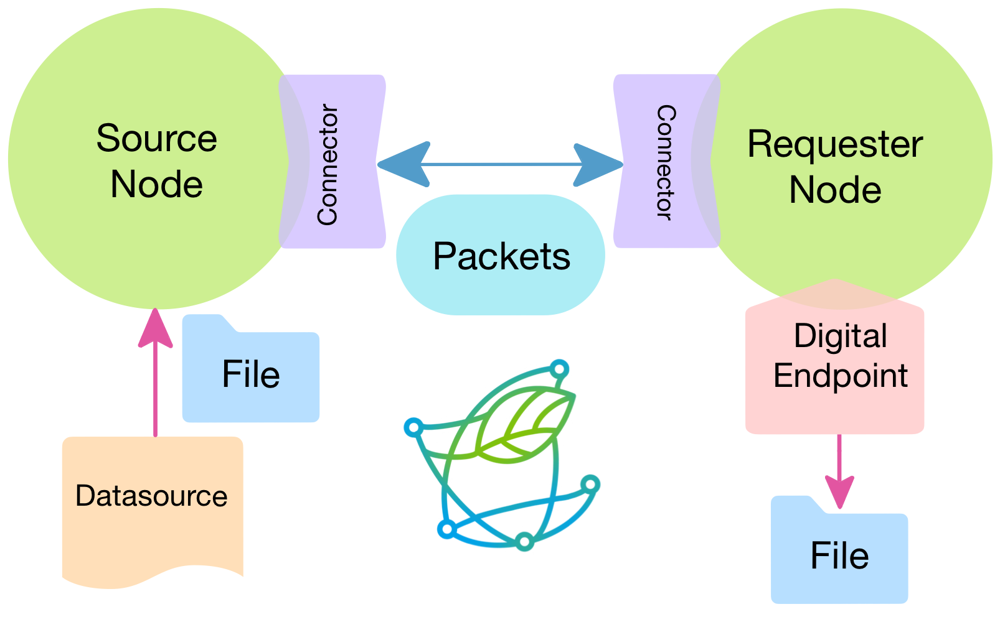
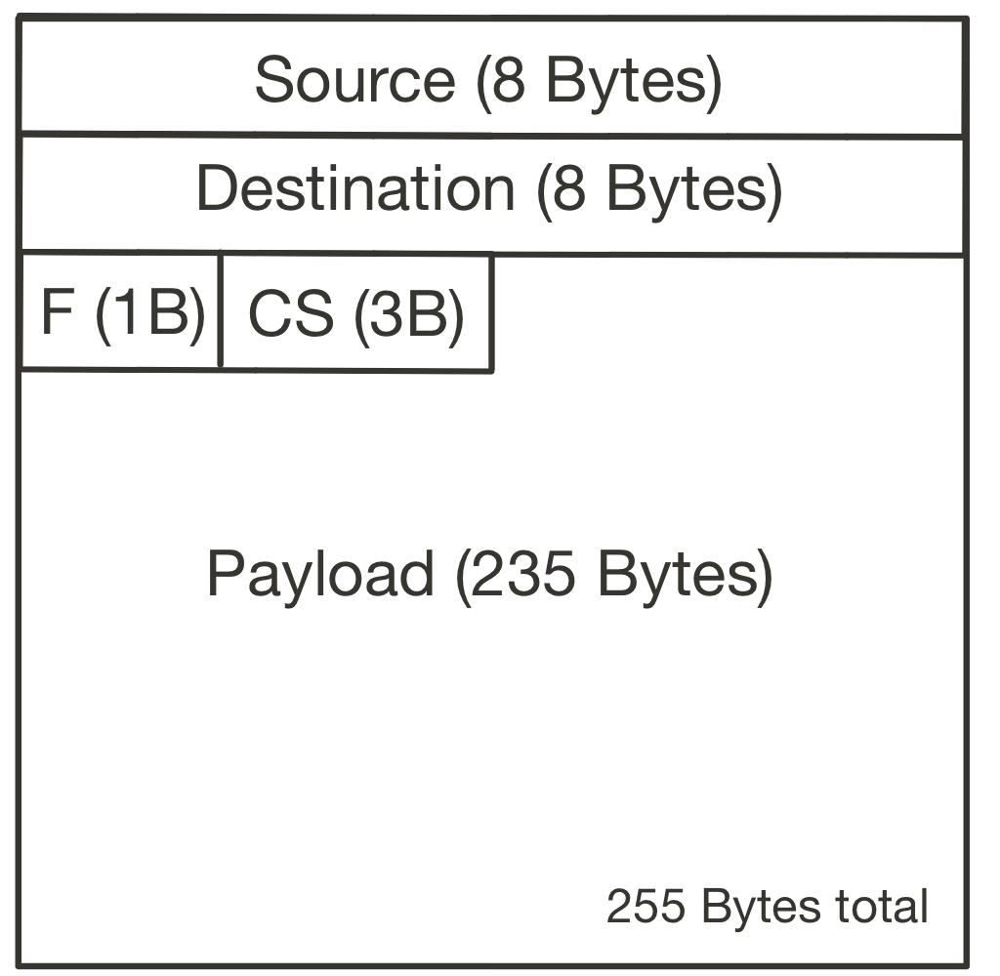
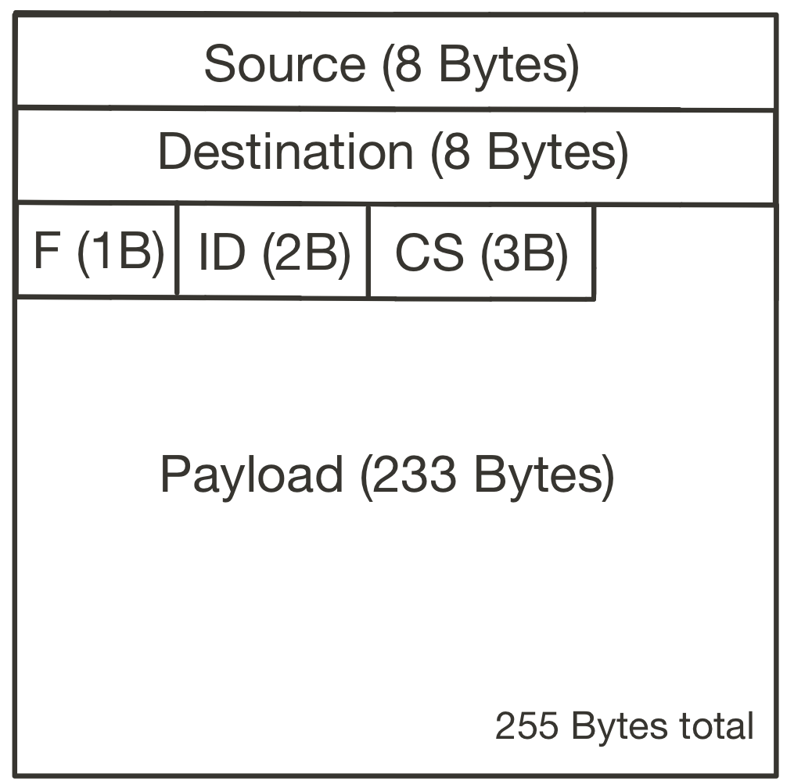
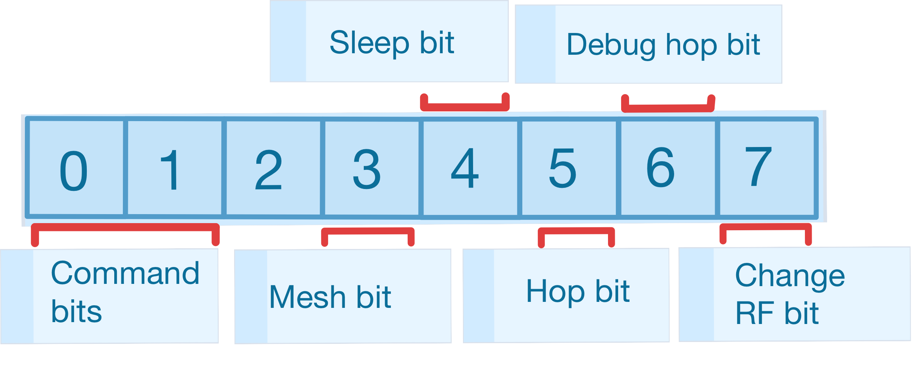

# ****AlLoRa:**** Advanced layer LoRa

Cite this repository: [](https://zenodo.org/badge/latestdoi/509513450)

<p align="center">
    
</p>

The code in this repository contains a toolbox that allows transferring content over a LoRa channel. It’s based on the original [LoRaCTP](https://github.com/pmanzoni/loractp), adding a more modular design with mesh capabilities and larger packet sizes for faster transfers. 

Details of the protocol can be found in these articles: 

* [AlLoRa: Empowering environmental intelligence through an advanced LoRa-based IoT solution](https://www.sciencedirect.com/science/article/pii/S0140366424000641?via%3Dihub)

* [A modular and mesh-capable LoRa based Content Transfer Protocol for Environmental Sensing](https://ieeexplore.ieee.org/document/10060496)

* [AI*LoRa: Enabling Efficient Long-Range Communication with Machine Learning at the Edge](https://dl.acm.org/doi/10.1145/3641512.3690040)


We're also developing a custom GPT, [AlLoRa Genius](https://chat.openai.com/g/g-rOGxxA1BZ-allora-genius), to assist in understanding and utilizing the AlLoRa protocol.

-----
## Learn by doing with these examples:

Check the [examples folder](examples) for more information about how to run the examples. 

Links of interest:

- [Setting up AlLoRa in LilyGo T3S3 devices](firmware/T3S3/)
- [Setting up AlLoRa in LoPy4 devices](examples/Requesters/LopyRequester)
- [Setting up AlLoRa in Raspberry Pi or other computers](examples/Gateways)


----
# Folders

Inside the repository, you will find the following folders:

## **AlLoRa**


<details>
<summary>It contains all the code necessary to setup a communication network between devices, from a point-to-point to a mesh with a gateway and multiple Source nodes.</summary>
    
### [Nodes](AlLoRa/Nodes)

<details>
<summary>A node is the element in charge of managing the communication logic for the Content Transfer Protocol.</summary>

  ### [Node.py](AlLoRa/Nodes/Node.py)

  It is the parent class from whom the other nodes inherits them base and common attributes and methods.
  It receives a boolean to indicate if the system is working on **mesh mode** or not and a **Connector**

  The Base Node is not supposed to be instantiated, it acts like an abstract class for the other Nodes (MicroPython doesn't support abstract classes, so we used a Parent class instead...)

  The main methods in this class are send_request and send_response.

  ### [Source.py](AlLoRa/Nodes/Source.py)

  It is a structure whose purpose, as its name implies, is to send one or more **Files**. It waits and listens for requests from a **Requester** or **Gateway** Node and syncs with them to send blocks (we call them chunks) of bytes of a File, until it finishes and is ready to send another one.  

   <details>
   <summary><b><u>Usage</u></b></summary>

   ### [Source](AlLoRa/Nodes/Source.py) usage:
   1. Instantiation:

      For the user, the Source must be instantiated with the same parameters explained in **Node**, plus:

      -name: A nickname for the Node, it shouldn’t be too large, we recommend a maximum of 3 characters, for the testing we used one letter (Nodes “A”, “B”, “C”…)
      
      -chunk_size (optional): It is the size of the payload of actual content to be sent in each ***Packet**. The maximum and default chunk_size is 235 for p2p mode and 233 for mesh mode, but if for some reason the user prefers to make it smaller, this is the parameter to change.

 1. Establish Connection: 

    The first thing to do with the Source is to use the establish_connection method. It will wait until a message for itself arrives, in order to sync with the Requester/Gateway Node.

 2. Set a File:

    Now, we can start using the Node to send **Files**. For this, we use the set_file method, that receives a previously instantiated object of the class **File** (more about it above…). Another way to set a file to sent is with the restore_file method, but this is only supposed to be used when the code had some type of interruption, and we need to continue sending a File “mid-chunk”.

 3. Send the File:

    After this, we call the send_file method, and it will manage the transfer of all the chunks  of the File to be sent.


 ### Example:

 ```python
 from AlLoRa.Nodes.Source import Source

 lora_node = AlLoRa_Source(name = "A", connector = connector,
          chunk_size = 235, mesh_mode = True, debug = False)

 lora_node.establish_connection()
 lora_node.set_file(file_to_send)
 lora_node.send_file()
 ```
 </details>

 ### [Requester.py](AlLoRa/Nodes/Requester.py)

 It is a structure whose purpose, as its name implies, is to receive **Files**. It asks information to a **Source** and listens for the responses. In order to communicate with an specific Node, the Requester must have the information of this endpoint, for this,  we use the **Digital_Endpoint** class, who contains the MAC Address of the endpoint and manages the states of the communication and generates the complete **File** when the Requester finishes collecting all the chunks.

 <details>
 <summary><b><u>Usage</u></b></summary>

 ### **Requester** usage:

 1. Instantiation:

 For the user, the Requester must be instantiated with the same parameters explained in **Node**, plus:

- debug_hops (optional):  If True, the Sources will override the message to be sent and register the message path (or hops between Nodes), more information about this below. The default is False.
  
- NEXT_ACTION_TIME_SLEEP (optional): Is the time (in seconds) between actions for the Requester in order to listen to the Source. The default is 0.1 seconds, but you can experiment with this number if you want.

1. Listen to endpoint:

    Once instantiated, we can use the method listen_to_endpoint, who needs a **Digital_Endpoint** to operate and a listening_time. We can use a loop to ensure that the **File** to be received arrives completely, but we can also use this listening_time to avoid getting stuck for too long while waiting for it to arrive.

### Example:

```python
from AlLoRa.Nodes.Requester import Requester

lora_node = Requester(connector = connector, mesh_mode = True, debug = False)

lora_node.listen_to_endpoint(digital_endpoint, 300)

#We can access the file like this:
ctp_file = digital_endpoint.get_current_file()
content = ctp_file.get_content()
```
</details>

### [Gateway.py](AlLoRa/Nodes/Gateway.py)

It is a practically a **Requester Node** (actually, it inherits from it) but it has the capability to manage multiple **Source Nodes**, receiving a list of **Digital_Endpoints** to check.
    
    
</details>    
    
### [Connectors](AlLoRa/Connectors)
    
<details>
<summary>A connector is the element that gives and manages the access to LoRa to a Node. The main objective of the connector is to make AlLoRa available to as many type of devices as possible. Many devices have embedded LoRa capabilities, while others maybe not, so the connector is a class that acts as a bridge to LoRa.</summary>
        
### [Connector.py](AlLoRa/Connectors/Connector.py)

It is the parent class from whom the connectors inherits them base attributes and methods.

It manages the methods to send and receive data using raw LoRa, gives access to the RSSI of the last received package and the MAC address of the device. It also contains the method send_and_wait_response, whose function is to send a packet (usually with a request) and wait for a predefined period of time (WAIT_MAX_TIMEOUT).

### [LoPy4_connector.py](AlLoRa/Connectors/LoPy4_connector.py)

This type of connector is very straightforward, it uses the native library for using LoRa from the LoPy4 (Only tested in LoPy4)

### [SX127x_connector](AlLoRa/Connectors/SX127x_connector.py)

This connector was developed to use in a Raspberry Pi connected to a Dragino LoRa/HPS HAT for RPi v1.4. It uses the SX127x library to manage the Raspberry Pi’s GPIOs in order to control the Dragino and send packages using a LoRa channel. It also works with ESP32 that uses the SX127x.

### [Wifi_connector.py](AlLoRa/Connectors/Wifi_connector.py)

Is the counterpart of the [AlLoRa-WiFi_interface](AlLoRa/Interfaces/WiFi_interface.py), developed to use in a Raspberry Pi, but also tested on computers running macOS and Windows. 

</details>
    
### → [Datasource.py](AlLoRa/DataSource.py)

A Datasource is a handy class that can be use to manage the files to be send. It is supposed to be used to feed Files to send to a Source Nodes.

### → [Digital_Endpoint.py](AlLoRa/Digital_Endpoint.py)

Contains the MAC Address of the endpoint to communicate with and manages the states of the communication. It also manages the generation of the complete **File** when the Requester finishes collecting all the chunks.

It also manages the “state” or phase in which the transfer is. 

### → [File.py](AlLoRa/File.py)

It is the class who focus on the actual File to be sent or received. It can be used to obtain the chunks of the content to transfer to the Source Nodes and also assembly all the blocks received to obtain the complete File in the Requester/Gateway side.

It can be instantiated with content (byte array) to be used by the Source to transmit the content, or it can also be instantiated as a “container”, in order to receive the chunks and finally assemble it to obtain the whole content, in the Requester side.

### → [Packet.py](AlLoRa/Packet.py)

This class structures the actual packet to be sent through LoRa. It manages the creation of the message to be sent and also is capable of load the data received by LoRa in order to check that the message was correctly received (with checksum). 
It is composed by a header and the actual payload. 

</details>


## Examples

Contain examples of uses of the AlLoRa code with different types of devices and levels of complexity.

## Firmware

Contains the necessary firmware to setup devices to work with AlLoRa.

-----
# **How does it work?**

<p align="center">
  
</p>

As we can see in the image above, the protocol is structured in a symmetrical way. At the left we have the Source side, with a **Source Node** that receives an **AlLoRa File** to be sent from a **Data Source**, and uses a **Connector** to access LoRa to send **AlLoRa Packets**. 

At the right we have the Requester side, with a **Requester Node** that receives a **Digital Endpoint**, that provides the Source information, in order to listen to it to receive the **AlLoRa File**, it also uses a **Connector** to access LoRa to receive the **AlLoRa Packets**, that contains the chunks (blocks of bytes) of the content transmitted.

## → Communication logic

The system follow a logic of requests from the Requester to the Source. Depending of the state of the state of the **Digital Endpoint**, the Requester will send requests to the specific Source and wait a time for an answer or reply. If the answer does not arrive or it arrives with corruptions, the Requester Node will repeat the request until the message arrives correctly (with a timeout when necessary).

The **Digital Endpoints** operates with the following states or phases of the communication:


1. **Establish connection**
    
    Every Digital Endpoint start in this state, is sends a simple packet with the command “ok” and waits until a “ok” from the Source is received, then, it continues to the next state. 
    
2. **Ask metadata**:
    
    This is the first step for receiving an **AlLoRa File**, it asks the Source for the metadata of the content to be received and waits until a Packet arrives with the name and the number of chunks of the content. In this stage, the **Digital Endpoint** creates an empty **AlLoRa File** object that will act as a container for the incoming chunks. If successful, it continues to the next state.
    
3. **Ask for data**
    
    In this state, the Requester will sequentially ask for the chunks necessary to obtain the whole content. When a chunk arrives, it will feed the **AlLoRa File** object until it collected all. When the **AlLoRa File** is complete, it will be assembled and the content will be ready to access or saved.
    
4. **Final acknowledge**
    
    In order to maintain the synchronization between the Nodes, a final acknowledge will be sent, and the system will wait until the Source replies with an “ok” command.

**More information about how the commands work in the Packet Structure section**

## → Packet Structure

The [Packet](AlLoRa/Packet.py) is the fundamental data unit transmitted via LoRa. It is designed to optimize the payload size while ensuring reliable reception by the designated Node. Each Packet has a maximum size of 255 bytes, which is the maximum payload supported by LoRa.

### Header Composition

The header size varies depending on the communication mode (point-to-point or mesh), but it follows a standard structure:

- **MAC Addresses (16 bytes):** The first 8 bytes are allocated for the source Node’s MAC address, and the next 8 bytes are for the destination Node’s MAC address.
- **Command and Flags (1 byte):** This byte encodes the command type and several flags that dictate packet behavior.
- **Checksum (3 bytes):** These bytes verify content integrity by checking for corruption using the last 3 bytes of the SHA-256 hash digest.
- **Message ID (2 bytes, mesh mode only):** Used to manage retransmissions and prevent chunk duplication. The ID is a random number between 0 and 65,535.

### Packet Types

The header size impacts the payload capacity:

- **Point-to-Point Packet:** 20-byte header, allowing for a maximum payload of 235 bytes.
- **Mesh Packet:** 22-byte header, allowing for a maximum payload of 233 bytes.

Optional MAC compression can reduce header size, effectively increasing the payload capacity:

- **Compressed Point-to-Point Packet:** 12-byte header, allowing for a payload of 243 bytes.
- **Compressed Mesh Packet:** 14-byte header, allowing for a payload of 241 bytes.

<div align="center">
<table>
<tr>
<th>Point-to-Point Packet</th>
<th>Mesh Packet</th>
</tr>
<tr>
<td>
<pre>

</pre>
</td>
<td>
<pre>

</pre>
</td>
</tr>
</table>
</div>

---

### Flag Composition

The Flag byte controls the behavior of the packet and consists of:

<p align="center">
  
</p>

#### Flag Bits:
1. **Command (2 bits):** Specifies the command type:
    - **00 → DATA:** Payload contains a requested chunk.
    - **01 → OK:** Acknowledges connection or confirms correct reception of content.
    - **10 → CHUNK:** Requests a specific chunk of data (chunk number stored in payload).
    - **11 → METADATA:** Requests or provides metadata, such as file name and size.
      
2. **Mesh bit (1 bit):** Indicates if the message should be forwarded.
   
4. **Hop bit (1 bit):** Signals that the message was forwarded at least once.
   
6. **Debug hop bit (1 bit):** Enables debugging by replacing content with path details for research purposes.
   
8. **Change RF bit (1 bit):** Signals a change in the radio frequency configuration between Nodes.

#### Optional MAC Compression:

- **MAC Address Compression:** Reduces MAC addresses from 8 bytes to 4 bytes using binary struct packing. This feature is optional and can be configured based on deployment needs, allowing for backward compatibility with older deployments.


## → Mesh mode

If the communication protocol has the mesh mode activated, the communication will work exactly the same as described before, but in the case of a request don’t being answered by a Source for a specific number of times (set by the user), the Digital Endpoint will jump to `retransmission mode`. Activating the mesh bit in the Packet in order to tell the other Nodes in the system to retransmit the message if received, to extend the reach of the system and try to establish the communication with the missing Node.

If a Source Node receives a Packet that is not for itself, it usually discards it and keep listening for request directed to it. But with the mesh bit activated, it will forward it to help reach the real destination. For this forwarding, the Node sleeps for a random time between 0.1 and 1 second before sending it. This reduces the possibility of collisions between Packets when multiple Nodes are active and in reach between them. Each time a Packet is forwarded, the Hop bit of it will be activated in order to announce that it actually went through other devices during its path. When the destination Node receives its message, it notices that the message arrived using the “retransmission mode” and creates a response Packet with the mesh bit activated, because it assumes that if it arrived like this, it is probably that the response will reach the Gateway jumping through the same path. In this case, the Node doesn’t sleep before sending the response, prioritizing always the Source Node being requested something.

If the response Packet arrives with the Hop bit off to the Gateway, it means that it didn't go through any other Node in order response to the request, indicating that the retransmission maybe are not needed. In this cases the Gateway will deactivate the “retransmission mode” of this specific Digital Endpoint.

In order to avoid duplication and over retransmission of messages that could collapse the system, each new Packet is assigned a random ID by the Node, and is saved in a fixed-size list that is checked wherever a new message with mesh bit activated arrives. The Nodes also have another fixed-size list that saves all the forwarded message’s IDs and that checks to avoid forwarding multiple times the same Packet.

## → Debug Hops

The debug hops is an option available to activate when instantiating a Requester or Gateway Node, and is a useful tool to check the path of a Packet when using the Mesh mode. It overrides the messages and focus on register in the payload each time the Packet goes through a Node. This information can be later retrieved in the Requester/Gateway Node’s device’s memory and can be used to make decisions about the distribution of the Nodes in the area to cover.

The output of this process generates a log_rssi.txt file that looks like this:

```
022-06-17_17:11:40: ID=24768 -> [['B', -112, 0.5], ['A', -107, 0], ['B', -106, 0.3], ['C', -88, 0.2], ['G', -100, 0]]
2022-06-17_17:11:50: ID=2065 -> [['C', -99, 0.4], ['B', -93, 0], ['C', -93, 0.2], ['G', -105, 0]]
2022-06-17_17:11:53: ID=63728 -> [['C', -100, 0.4], ['B', -95, 0], ['C', -95, 0.5], ['G', -103, 0]]
2022-06-17_17:11:54: ID=32508 -> [['B', -114, 0], ['C', -95, 0.4], ['G', -103, 0]]
2022-06-17_17:11:56: ID=10063 -> [['C', -99, 0.1], ['B', -95, 0], ['C', -94, 0.1], ['G', -103, 0]]
```

Where it shows the time of reception, the ID of the message and then a list of hops that the Packet did. Each hop saves the  name of the Node, the RSSI of the last package received with LoRa when registering the hop, and the random time that the Node had to wait before forwarding the message. As we can see, in some cases this random sleep is 0. This is not random, because those Nodes were the destination of the requests of the Gateway, and, as commented before, they have the priority.


